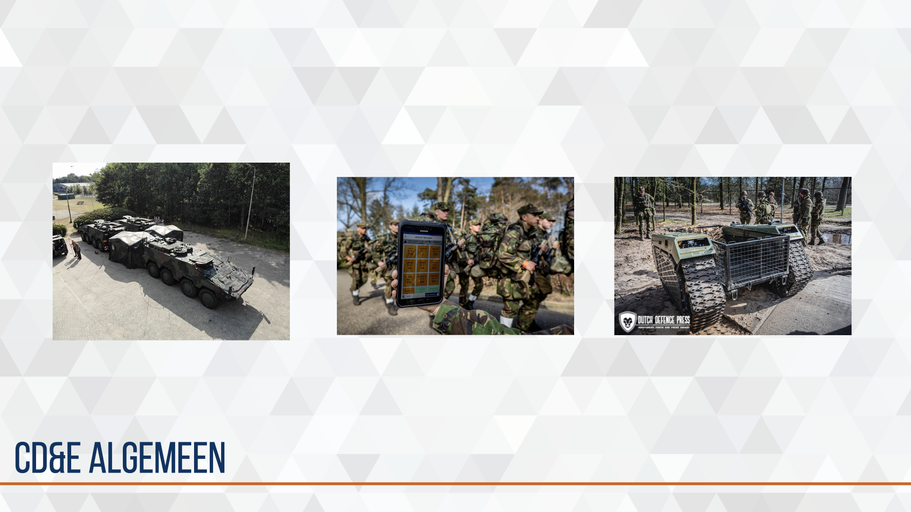
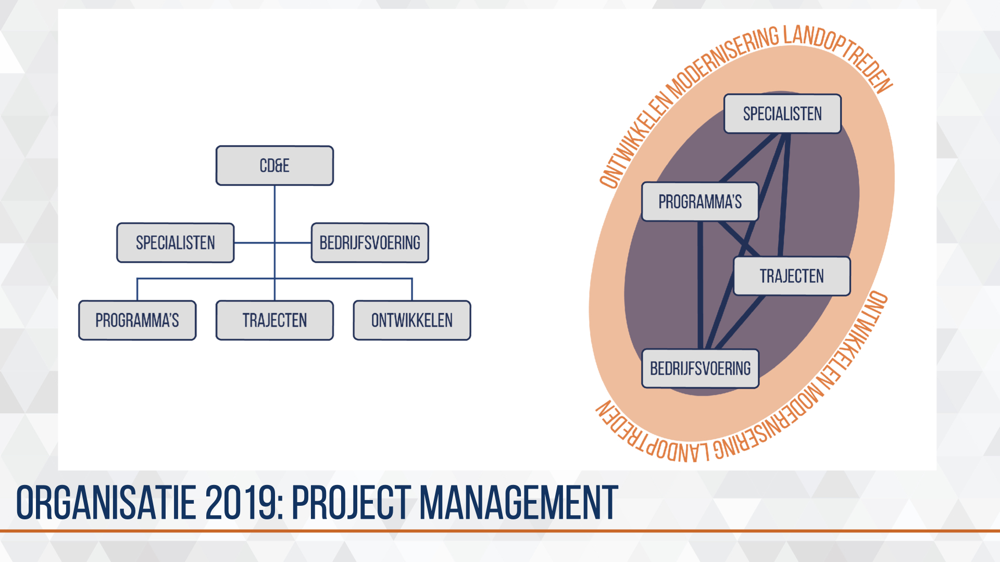
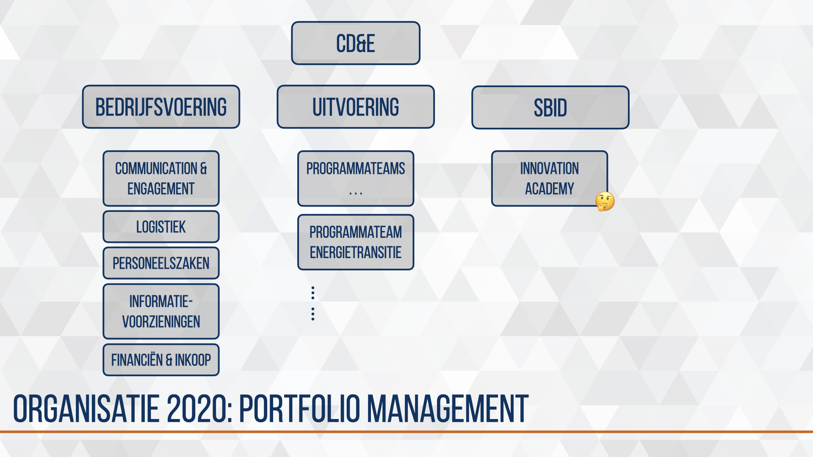
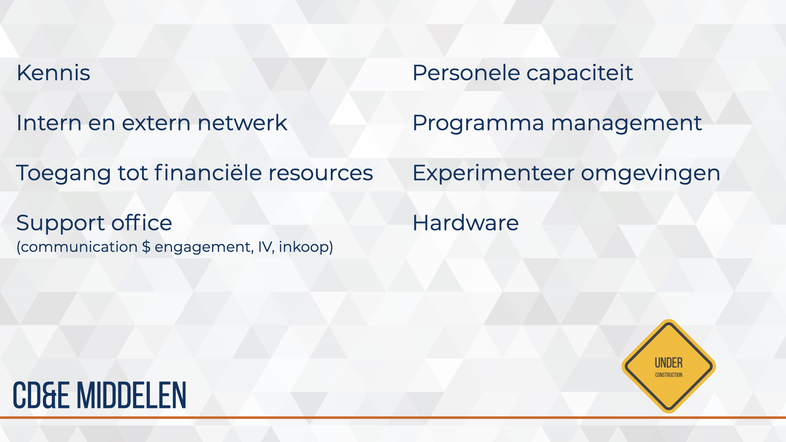

# CD&E algemeen{#cde-algemeen}
<!--  -->
```{r,  fig.cap=' ', echo=FALSE}
# img_dir <-
img1_path <- "data/keynote-slides/20200430-CDE-Designprocess/20200430-CDE-Designprocess.003.png"
img1 <- readPNG(img1_path, native = TRUE, info = TRUE)
knitr::include_graphics(img1_path)
rm(img1_path, img1)
```

### CD&E binnen CLAS-modernisering {-}
<!-- [fig:simpel-proces] -->
```{r, simpel-proces, fig.cap='Eenvoudig CLAS moderniseringsproces met positionering CD&E', echo=FALSE}
# img_dir <-
img1_path <- "data/keynote-slides/20200430-CDE-Designprocess/20200430-CDE-Designprocess.008.png"
img1 <- readPNG(img1_path, native = TRUE, info = TRUE)
knitr::include_graphics(img1_path)
rm(img1_path, img1)
```

Figuur \@ref(fig:simpel-proces) en vereenvoudigde visualisatie van het ‘klassieke’ moderniseringsproces van de Landmacht. Dit proces kan worden onderverdeeld in vier aandachtsgebieden, de landmacht van vandaag (LvV), morgen (LvM), overmorgen (LvOM) en het landoptreden van de toekomst (LvT). Verschillende organisatie-onderdelen dragen bij aan deze aandachtsgebieden. Grofweg kan de verantwoordelijkheid (responsibility) worden toebedeeld aan respectievelijk de parate eenheid, afdeling strategie & plannen, kenniscentrum en afdeling trends & concepts.
In dit proces vindt backcasting plaats doordat onderzoek, studies en verkenningen richting geven aan modernisering voor LvM en LvV en forecasting doordat evaluaties, lessons learned en experimenten richting geven aan beleid, budgettering en kennisplanning.

CD&E programma’s dragen hoofdzakelijk bij aan de landmacht van morgen en overmorgen.

## positionering in defensie organisatie
<!--  -->
```{r, fig.cap='Positionering innovatiecentra binnen Defensie ', echo=FALSE}
# img_dir <-
img1_path <- "data/keynote-slides/20200430-CDE-Designprocess/20200430-CDE-Designprocess.009-1.png"
img1 <- readPNG(img1_path, native = TRUE, info = TRUE)
knitr::include_graphics(img1_path)
rm(img1_path, img1)
```

CD&E is het innovatiecentrum van de Landmacht. Ook de andere defensieonderdelen kennen innovatiecentra, ieder opgebouwd in de kenmerken en cultuur van het defensieonderdeel.

## organisatie 2019: multi-project management
<!--  -->
```{r, fig.cap='Organisatie structuur voor multi-project management ', echo=FALSE}
# img_dir <-
img1_path <- "data/keynote-slides/20200430-CDE-Designprocess/20200430-CDE-Designprocess.009-2.png"
img1 <- readPNG(img1_path, native = TRUE, info = TRUE)
knitr::include_graphics(img1_path)
rm(img1_path, img1)
```

In 2019 groeide het team dusdanig dat enige verdeling en specialisatie onvermijdelijk werd. Teams werden ingericht naar activiteiten en he niveau wat hoofdzakelijk werd gesteund.
Trajecten groepeerde de trajectbegeleiders en werkte voornamelijk met de kenniswerkers (kennis- en expertise centra) en stafmedewerkers (parate eenheid).
Binnen Programma’s zaten programma-managers die de kennisadviseurs en dossierhouders (afdeling Strategie en Plannen) steunde in het opzetten van routekaarten van operationele wensen en behoefte.
Ontwikkelen was gericht op de strategische inbedding van alle inspanningen.
Bedrijfsvoering voor alle CD&E ondersteunende processen, uitvoering evenementen en logistieke ondersteuning.
De vele individuele of specifieke teamleden werden onder Specialisten geschaard.

De aanpak is een olievlekwerking. Met trajecten en programma’s voorbeelden creëren waardoor operationele en bedrijfsmatige knelpunten zichtbaar worden zodat deze geadresseerd kunnen worden bij de juiste entiteiten. Dit draagt bij aan het structureel kort-cyclisch moderniseren in het landoptreden.

## transitie 2020
<!--  -->
```{r, fig.cap='Van multi projecten via 3-horizon model naar routekaarten.', echo=FALSE}
# img_dir <-
img1_path <- "data/keynote-slides/20200430-CDE-Designprocess/20200430-CDE-Designprocess.009-3.png"
img1 <- readPNG(img1_path, native = TRUE, info = TRUE)
knitr::include_graphics(img1_path)
rm(img1_path, img1)
```

In 2020 deden we een herijking op het project portfolio zodat de focus blijft op de juiste initiatieven. Deze herijking was een staf integraal beschouwen van projecten op relevantie, urgentie, noodzaak en realiseerbaarheid binnen het landoptreden. De herijking maakte de vele initiatieven inzichtelijk en keuzen door Directeur Kennis & Ontwikkeling mogelijk. De multi-project aanpak creeerde daarmee een vorm van overzicht, inzicht en regie. (Foto brownpaper nog toevoegen)

Het werd tijd voor de volgende stap waarin meer richting wordt gegeven aan de initiatieven vanuit ambitie, markt tempo en markt potentieel.

De programmatische aanpak was daarvoor gekozen. Programma-managers inventariseren moderniseringsinitiatieven bij de 9-14 kennisadviseurs m.b.v. Boill Sharp’s 3-horizon model en visualiseren met hiërarchie-boom-structuur.

## organisatie vanaf 2020: portfolio management
<!--  -->
```{r, fig.cap='Organisatie structuur naar programmatische aanpak ', echo=FALSE}
# img_dir <-
img1_path <- "data/keynote-slides/20200430-CDE-Designprocess/20200430-CDE-Designprocess.009-4.png"
img1 <- readPNG(img1_path, native = TRUE, info = TRUE)
knitr::include_graphics(img1_path)
rm(img1_path, img1)
```

In 2020 groeide CD&E uit tot een volwaardige innovatie partner, werden CD&E en DAK-C samengevoegd in een Afdeling Innovatie onder de Directie Kennis & Ontwikkeling, consolideerde het budget, werden de moderniseringsvraagstukken groter en complexer en werd zichtbaar en merkbaar voortgang geboekt met strategische inbedding.

Het was tijd om opnieuw de structuur en benadering aan te passen. Programma-management is de gekozen aanpak omdat dit planbaar en beheersbaar is in de interne bedrijfsvoering en herkenbaarheid en vertrouwen creëert in de samenwerking met externe partners (koepelorganisaties, MKB-ers, kennisinstituten). Er worden daarom hoofd-programma’s geformeerd rondom een specifiek thema, hierin zitten verschillende moderniseringsprojecten. Een programmateam met programma-managers en trajectbegeleiders werken samen aan het hoofdprogramma.

Alle programma’s komen onder uitvoering terwijl de (door)ontwikkeling en strategische inbedding worden samengebracht bij Strategic Business & Innovation Development (SBID). Er komst dus een scheiding tussen toekomst, uitvoering en ondersteuning.

## CD&E middelen
<!--  -->
```{r, fig.cap='Middelen voor faciliteren en ondersteunen van innovatie door CD&E ', echo=FALSE}
# img_dir <-
img1_path <- "data/keynote-slides/20200430-CDE-Designprocess/20200430-CDE-Designprocess.009-5.png"
img1 <- readPNG(img1_path, native = TRUE, info = TRUE)
knitr::include_graphics(img1_path)
rm(img1_path, img1)
```

De uitvoering van kort cyclische moderniseringsprojecten vindt plaats op locatie en in eigenaarschap van een kenniscentrum of parate eenheid, CD&E steunt en faciliteert. Hiervoor heeft CD&E een aantal middelen en diensten tot haar beschikking. Dit zijn de middelen en diensten die niet vanzelfsprekend toegankelijk zijn voor de betrokken partijen of vanwege schaarste of efficiëntie beter tot hun recht komen door centrale positionering.

### begeleiden en faciliteren
De belangrijkste diensten van CD&E zijn het begeleiden van de Landmacht-professionals bij het innoveren van hun vak. Daarom neemt CD&E geen primair eigenaarschap in de programma's of projecten maar steunt de opdrachtgever, -nemer en overige betrokkenen in het gehele traject tot implementatie en escaleert naar de juiste niveaus waar nodig.

### experimenteer omgeving & innovatie hub
<!--  -->
```{r, fig.cap='Fieldlabs van Smart industry in Nederland ', echo=FALSE}
# img_dir <-
img1_path <- "data/keynote-slides/20200430-CDE-Designprocess/20200430-CDE-Designprocess.009-6.png"
img1 <- readPNG(img1_path, native = TRUE, info = TRUE)
knitr::include_graphics(img1_path)
rm(img1_path, img1)
```

De eerste grootschalige uitvraag aan de markt heeft in 2016 plaats gevonden. Gericht op de base van de toekomst zijn de uitdagingen geschetst op de thema’s energie, bescherming, water en logistiek. Op Kamp Soesterberg is de basis van een militair kampement opgebouwd met de formele fieldlab status van Smart Industry. Dit Fieldlab Smartbase heeft de Landmacht veel ervaring en kennis opgeleverd over het proces en inhoud.
Sinds september 2019 is dit fieldlab verhuist naar Complex Ede-Driesprong waar externe partners kunnen experimenteren binnen de militaire context.
