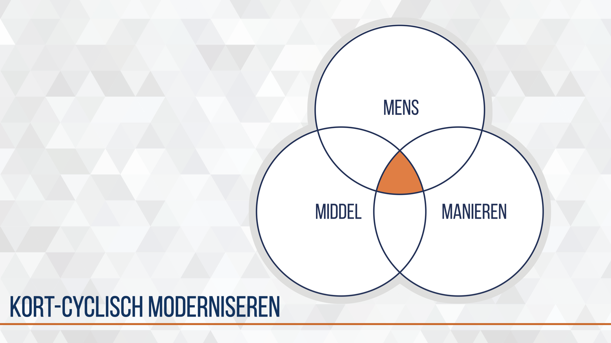
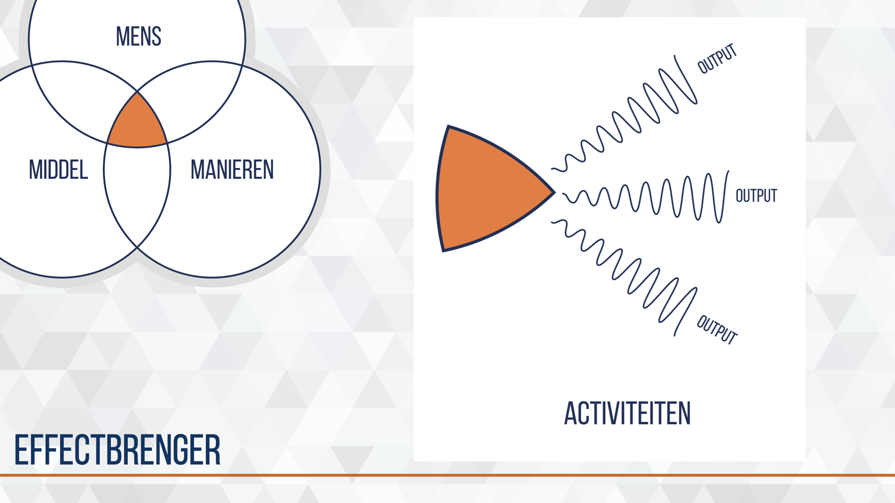

# How to think{#kort-cyclisch-moderniseren}
<!--  -->
```{r, fig.cap='De unieke combinatie van mens, manier en middel maakt een effectbrenger.', echo=FALSE}
# img_dir <-
img1_path <- "data/keynote-slides/20200430-CDE-Designprocess/20200430-CDE-Designprocess.009.png"
img1 <- readPNG(img1_path, native = TRUE, info = TRUE)
knitr::include_graphics(img1_path)
rm(img1_path, img1)
```

De landmacht is een overheids organisatie die -waar nodig- een zwaardmacht moet zijn op plekken waar vrede en veiligheid geen vanzelfsprekendheid is. Vanuit de grondwettelijke taken is afgeleid hoe de Landmacht optreedt, welke materieel en personele middelen daarvoor nodig zijn en hoe dit wordt georganiseerd. Deze lineaire denkmodellen dragen decenia lang bij aan de innovatie in het landoptreden. De bestaande Landmacht organisatie is in een continue verbeter modus vanuit deze volgordelijkheid.

De technologische en sociale innovaties gaan echter zo snel dat ook op andere, snellere manieren moet worden gekeken naar modernisering van de bestaande organisatie en vernieuwing voor de toekomstige organisatie.

Military Design & Innovation geeft manieren om innovatie bij de Landmacht uit te voeren in het tempo van de markt. Centraal staat daarbij een integrale aanpak, met externe partijen door experimenten. Het denkmodel wat we hierbij gebruiken heet 'de effectbrenger'.

## effectbrenger
<!--  -->
```{r, effectbrenger, fig.cap='Een effectbrenger genereert activiteiten met een specifieke output.', echo=FALSE}
# img_dir <-
img1_path <- "data/keynote-slides/20200430-CDE-Designprocess/20200430-CDE-Designprocess.010.png"
img1 <- readPNG(img1_path, native = TRUE, info = TRUE)
knitr::include_graphics(img1_path)
rm(img1_path, img1)
```

Een military capability, organisatie onderdeel of subsysteem is een unieke combinatie van Mens, Manieren en Middel(en). Deze unieke combinatie noemen we een effectbrenger. Deze effectbrenger voert activiteiten uit met een specifieke, direct te relateren, output.

### system in system {-}
```{r, fig.cap='Fractile patroon van effectbrengers', echo=FALSE}
# img_dir <-
img1_path <- "data/images/20190710-CDE-designproces_CDE-FractileModel.png"
img1 <- readPNG(img1_path, native = TRUE, info = TRUE)
knitr::include_graphics(img1_path)
rm(img1_path, img1)
```

Inzoomen op de effectbrenger als operationele entiteit zien we een fractile pattern ontstaan. Zoals we een groep plaatsen in een peloton, compagnie, bataljon en brigade maakt een effectbrenger ook altijd deel uit van een groter verband. Dit zorgt voor een extra dimensie in de complexiteit van het Design process. Voorlopig noem ik deze dimensie de operationele opschaling.

## gewenst effect en ambitie
<!--  -->
```{r, eieren, fig.cap='Abstracte vormgeving van drie situaties of contexten in een experiment.', echo=FALSE}
# img_dir <-
img1_path <- "data/keynote-slides/20200430-CDE-Designprocess/20200430-CDE-Designprocess.011.png"
img1 <- readPNG(img1_path, native = TRUE, info = TRUE)
knitr::include_graphics(img1_path)
rm(img1_path, img1)
```

De activiteiten en output genereren een reactie in de omgeving, het indirect te relateren, effect.

### huidige situatie {-}
Meestal is sprake van een bestaande effectbrenger die verbeterd wordt, soms wordt een geheel nieuwe effectbrenger ontwikkeld. In figuur \@ref(fig:eieren) is de huidige situatie gevisualiseerd met een bestaande effectbrenger die verbeterd wordt.

### experimentele situatie {-}
Samen met interne en externe partners ontwikkeld het kenniscentrum of de eenheid de beoogde effectbrenger zodat deze getest kan worden in een gecontroleerde, operationele omgeving. Er wordt als het ware een geconditioneerde omgeving gecreerd in een eenheid of oefening. Door het opzetten van een experimentele omgeving kan de ontwikkelde effectbrenger worden beproefd en kunnen de effecten op de omgeving worden waargenomen.

### gewenste situatie {-}
Een beoogde effectbrenger voert activiteiten uit in een specifieke context zodat een gewenste situatie of gewenst effect ontstaat. Dit kan klein zijn zoals de invloed van een persoon in een eenheid of ambitieus zoals een Iiformatie gestuurd landoptreden (IGO) in de visie CLAS. Deze gewenste eindsituatie wordt meegenomen in het denkmodel omdat de dit de meerwaarde zal bepalen van de ontwikkelde effectbrenger.

Een vraagstuk binnen het experiment is de haalbaarheid van het beoogde effect door de effectbrenger in de specifieke situatie. Afhankelijk van de experimenteer-omgeving zullen verschillende methoden worden toegepast om te kunnen valideren of het beoogde effect is bereikt.
