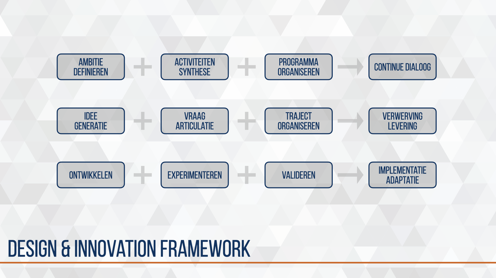
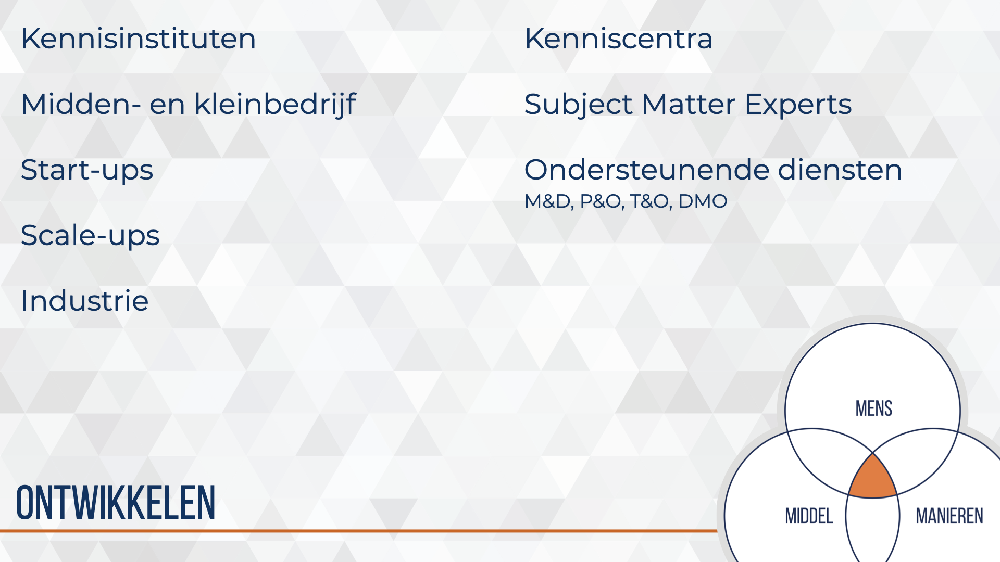

# CD&E design model {#CD&E-design-model}
<!--  -->
```{r, fig.cap='Totaal weergave van een design concept.', echo=FALSE}
# img_dir <-
img1_path <- "data/keynote-slides/20200430-CDE-Designprocess/20200430-CDE-Designprocess.012.png"
img1 <- readPNG(img1_path, native = TRUE, info = TRUE)
knitr::include_graphics(img1_path)
rm(img1_path, img1)
```

In het Design model wordt de samenstelling (synthese) van de verschillende subsystemen tot een (beoogd) effect in een specifieke context (de gewenste situatie) gevisualiseerd. Daarmee kan in een zeer abstracte visualisatie het traject van idee tot en met valideren worden geduid.

We zagen eerder de effectbrenger als een unieke samenstelling van mens, manieren en middel. Deze effectbrenger met activiteiten en output verhoud zich tot andere effectbrengers binnen een specifieke context (huidige situatie). Het idee voor een gemoderniseerde effectbrenger zal moeten bijdragen aan een effect in een specifieke context (gewenste situatie).  Door experimenteren wordt —een variant van— een gemoderniseerde effectbrenger ingebracht in een afgebakende, gecontroleerde context (experimentele situatie).

Het doel van het Design model is de relaties en afhankelijkheden van idee, effectbrenger en context te herkennen en daarbij te onderzoeken of het aanbrengen van een wijziging in een bestaande situatie leidt tot een meer gewenste of geambieerde situatie.

Het idee wordt geplaatst in ‘het grotere plaatje’ van het landoptreden.

## design & innovation framework
<!--  -->
```{r, fig.cap='Pallet aan activiteiten binnen het Military Design & Innovatie proces.', echo=FALSE}
# img_dir <-
img1_path <- "data/keynote-slides/20200430-CDE-Designprocess/20200430-CDE-Designprocess.013.png"
img1 <- readPNG(img1_path, native = TRUE, info = TRUE)
knitr::include_graphics(img1_path)
rm(img1_path, img1)
```

## ontwerpen
<!--  -->
```{r, fig.cap='In de ontwerpfase wordt invulling gegeven aan dit concept.', echo=FALSE}
# img_dir <-
img1_path <- "data/images/20190710-CDE-designproces_Model-MmmEffect.png"
img1 <- readPNG(img1_path, native = TRUE, info = TRUE)
knitr::include_graphics(img1_path)
rm(img1_path, img1)
```

Inzoomen op het ontwerpen van een effectbrenger zijn we binnen  CD&E steeds meer geïnteresseerd hoe we van rechts naar links kunnen ontwerpen. Dat wil zeggen vanuit een geambieerde situatie met beoogde effect een output’s, activiteiten en effectbrengers voorstellen die gerealiseerd kunnen worden door het combineren van mens, manieren en middel.

Voor het articuleren van ambitie en ontwikkel lijnen wordt gebruik gemaakt van het 3-Horizon model van Bill Sharp. Onder begeleiding van een programma-manager wordt met de verantwoordelijk kennisadviseur en betrokken kenniswerkers en subject matter expert een routekaar van operationele wensen en behoefte opgesteld. Deze routekaart leidt ondermeer tot strategisch onderbouwde keuze voor het oppakken van ideeën en experimenten.

## ontwerpen & ontwikkelen
<!--  -->
```{r, fig.cap='Fractile patroon van effectbrengers', echo=FALSE}
# img_dir <-
img1_path <- "data/images/20190710-CDE-designproces_CDE-FractileModel.png"
img1 <- readPNG(img1_path, native = TRUE, info = TRUE)
knitr::include_graphics(img1_path)
rm(img1_path, img1)
```

Inzoomen op de effectbrenger als operationele entiteit zien we een fractile pattern ontstaan. Zoals we een groep plaatsen in een peloton, compagnie, bataljon en brigade maakt een effectbrenger ook altijd deel uit van een groter verband. Dit zorgt voor een extra dimensie in de complexiteit van het Design process. Voorlopig noem ik deze dimensie de operationele opschaling.

## experimenteren
<!--  -->
```{r, fig.cap='Abstracte weergave van ontwerpen, experimenteren en valideren.', echo=FALSE}
# img_dir <-
img1_path <- "data/images/20190710-CDE-designproces_trajectuitvoering.png"
img1 <- readPNG(img1_path, native = TRUE, info = TRUE)
knitr::include_graphics(img1_path)
rm(img1_path, img1)
```

Een beoogde effectbrenger voert activiteiten uit in een specifieke context. Meestal is sprake van een bestaande effectbrenger die verbeterd wordt en is er dus ook sprake van een huidige situatie.
Samen met interne en externe partners ontwikkeld een kenniscentrum of parate eenheid de beoogde effectbrenger zodat deze getest kan worden in een gecontroleerde, operationele omgeving.
Door het opzetten van een experimentele omgeving kan de ontwikkelde effectbrenger worden beproefd en kunnen de effecten op de omgeving worden waargenomen.

Data wordt verkregen door het verschil te meten tussen de huidige context met huidige effectbrengers en de experimentele context met beoogde effectbrenger. Na processing en analyse kan deze data worden beschouwd op de gewenste context om zodoende iets zinnigs te kunnen zeggen over de haalbaarheid, nut en noodzaak van het ontwerp.

## ontwikkelen en samenwerken
<!--  -->
```{r, fig.cap='Enkele actoren voor samenwerking.', echo=FALSE}
# img_dir <-
img1_path <- "data/keynote-slides/20200430-CDE-Designprocess/20200430-CDE-Designprocess.017.png"
img1 <- readPNG(img1_path, native = TRUE, info = TRUE)
knitr::include_graphics(img1_path)
rm(img1_path, img1)
```
