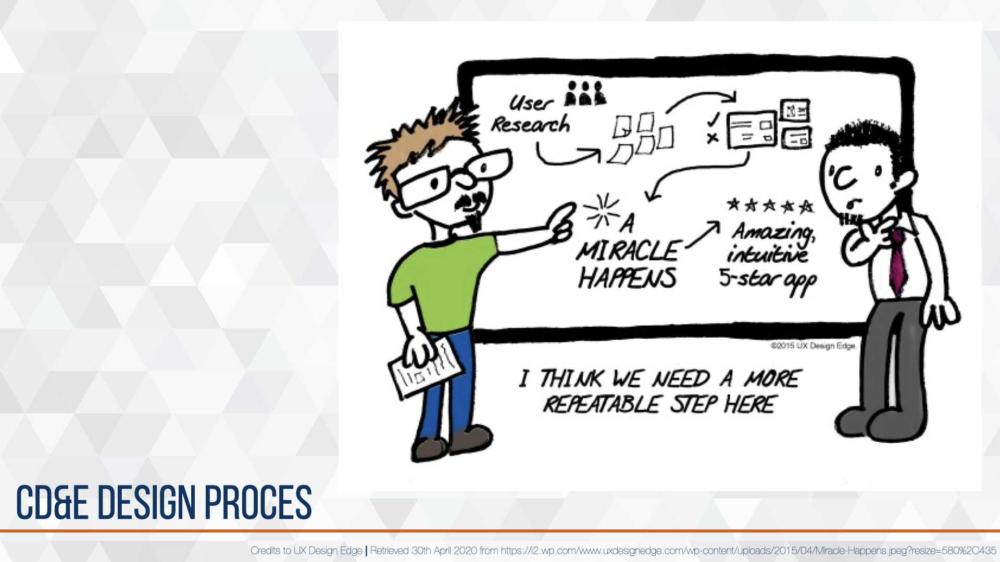
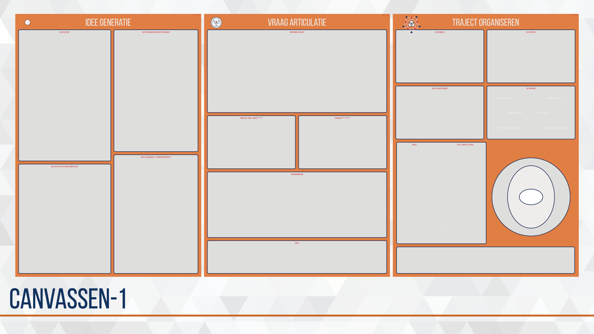
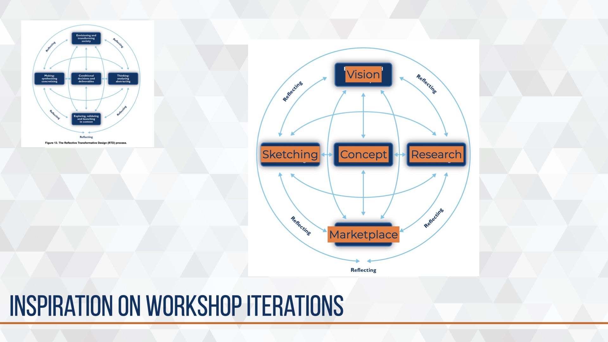
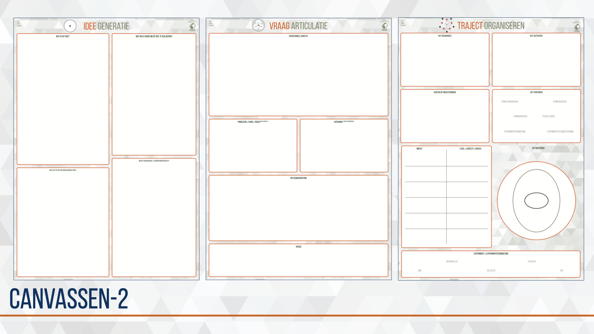

# Ontstaansgeschiedenis en doorontwikkeling{#cde-process}
<!--  -->
```{r, fig.cap=' ', echo=FALSE}
# img_dir <-
img1_path <- "data/keynote-slides/20200430-CDE-Designprocess/20200430-CDE-Designprocess.018.png"
img1 <- readPNG(img1_path, native = TRUE, info = TRUE)
knitr::include_graphics(img1_path)
rm(img1_path, img1)
```

De organisatorische uitdaging die de kenniswerker en de trajectbegeleiding hebben ligt vooral in de Hoe-vragen. Op welke manier kan de beoogde effectbrenger worden ontworpen, ontwikkeld, getest en geïmplementeerd in de bestaande Landmacht organisatie? Er is geen pasklaar antwoord, maar door de vele trajecten is wel een rode draad te ontdekken en zijn een aantal activiteiten, methoden en instrumenten die effectief blijken en vaker terug komen.

Vanuit deze kennis, vaardigheid en ervaring is het CD&E design proces ontwikkeld, en wordt het nog regelmatig aangepast, verbeterd en uitgebreid.

Hierna volgen de verschillende bouwstenen die gebuikt kunnen worden om het design proces vorm te geven. De bijzondere volgorde waarin de bouwstenen worden gepresenteerd zijn het meest effectief in de bureaucratische overheidsorganisatie Defensie die tevens als Aanbestedende dienst wordt gekenmerkt in de aanbestedingswet.

## position into crafstmen
<!--  -->
```{r, fig.cap='Het Military Design proces gepositioneerd in het EDL method.', echo=FALSE}
# img_dir <-
img1_path <- "data/keynote-slides/20200430-CDE-Designprocess/20200430-CDE-Designprocess.019.png"
img1 <- readPNG(img1_path, native = TRUE, info = TRUE)
knitr::include_graphics(img1_path)
rm(img1_path, img1)
```

Positioning the proces into the frame of @gardien_changing_2014.

## CD&E framework 2017-2018 (descriptive)
<!--  -->
```{r, fig.cap='Eerste schets van het CD&E design model uit 2018. ', echo=FALSE}
# img_dir <-
img1_path <- "data/keynote-slides/20200430-CDE-Designprocess/20200430-CDE-Designprocess.020.png"
img1 <- readPNG(img1_path, native = TRUE, info = TRUE)
knitr::include_graphics(img1_path)
rm(img1_path, img1)
```

De eerste schets van een framework van de inspanningen voor kort-cyclisch moderniseren voor het landoptreden. In het midden vier fase en stappen om te komen van een probleem naar een implementatie. Onderaan de schets de toenmalige middelen en diensten die door CD&E beschikbaar werden gesteld. De inspanningen waren gericht op het binnen halen van de externe innovatie (links) en via één of meerdere fase en stappen te brengen naar het vergroten van het innovatief vermogen in het landoptreden op de aspecten organisatie, doctrine en/of materieel. Deze inspanningen dragen uiteindelijk ook bij aan het verbeteren en versnellen van processen en procedures binnen de organisatie met de wens om zelfs culturele verandering te initiëren.

Het eerste framework werd gebruikt in een aantal projecten en bij het intern communiceren —en eenheid van opvatting creëren— over de initiatieven voor kort-cyclisch moderniseren in het landoptreden.

Als methodiek is het model van @klinkers_navigeren_2014 toegepast waarin de auteurs spreken van drie licenties. Licence to represent, licence to operate & licence to innovate.

Vanuit reflection in action ontstond het design-keten-proces, een basis template voor een CD&E-plan en een gemeenschappelijke taal.

## design-keten-proces 2018-2019
<!--  -->
```{r, fig.cap='Eerste opzet van MD&I activiteiten.', echo=FALSE}
# img_dir <-
img1_path <- "data/images/20190710-CDE-designproces_bouwstenenKeten.png"
img1 <- readPNG(img1_path, native = TRUE, info = TRUE)
knitr::include_graphics(img1_path)
rm(img1_path, img1)
```

Groei zorgt voor nieuwe uitdagingen, mogelijkheden en mensen. Het aantal moderniseringsvraagstukken steeg en werd gecompliceerder waardoor de noodzaak voor meer trajectbegeleiders ontstond, deze rol werd met prioriteit gevuld. Daarmee ontstond de noodzaak om de opgedane kennis, vaardigheid en ervaring te borgen. Hiervoor is het eerste design-keten-proces en bijhorende canvassen ontworpen, getest en geïmplementeerd in het team.

Voor het ontwerp is gebruik gemaakt van de ervaringen van vier trajectbegeleiders die enige ervaring hadden opgedaan in de periode 2015-2018 met het opstarten en organiseren van moderniseringsvraagstukken.

Bij het testen is gebruik gemaakt van vier nieuwe trajectbegeleiders zonder ervaring op nieuw ingebrachte vraagstukken. Deze vier nieuwe trajectbegeleiders werden opgeleid, getraind, begeleid en gecoacht door één ervaren trajectbegeleider.

Trajecten van idee naar implementatie zijn uniek.
Ieder traject een andere keten van bouwstenen.

**de eerste canvassen**
<!--  -->
```{r, fig.cap='Eerste canvassen prototype.', echo=FALSE}
# img_dir <-
img1_path <- "data/keynote-slides/20200430-CDE-Designprocess/20200430-CDE-Designprocess.023.png"
img1 <- readPNG(img1_path, native = TRUE, info = TRUE)
knitr::include_graphics(img1_path)
rm(img1_path, img1)
```

**toetsingscriteria**
<!--  -->
```{r, fig.cap='De indicatoren voor Military Design & Innovation.', echo=FALSE}
# img_dir <-
img1_path <- "data/keynote-slides/20200430-CDE-Designprocess/20200430-CDE-Designprocess.024.png"
img1 <- readPNG(img1_path, native = TRUE, info = TRUE)
knitr::include_graphics(img1_path)
rm(img1_path, img1)
```

Naast de canvassen en het mindmodel waren een aantal indicatoren opgesteld. Deze kregen helaas de naam selectie- of toetsingscriteria wat geen recht deed aan de kracht van indicatoren maar verwerd tot een binair goed/fout controle mechanisme. De indicatoren waren door mij opgesteld als reminder of checklist, ze moeten zijn overdacht en besproken in het proces. De mate waarin de indicator is doorgevoerd in het traject kan iets zeggen over de succesfactor op basis van eerdere kennis en ervaring.
**variaties op denkmodellen**
<!--  -->
```{r, fig.cap='Het RTDP-process is gebruikt als inspratie en methode om het MD&I te ontwikkelen.', echo=FALSE}
# img_dir <-
img1_path <- "data/keynote-slides/20200430-CDE-Designprocess/20200430-CDE-Designprocess.024-1.png"
img1 <- readPNG(img1_path, native = TRUE, info = TRUE)
knitr::include_graphics(img1_path)
rm(img1_path, img1)
```

**laatste ontwerp canvassen**
<!--  -->
```{r, fig.cap='Final ontwerp canvassen.', echo=FALSE}
# img_dir <-
img1_path <- "data/keynote-slides/20200430-CDE-Designprocess/20200430-CDE-Designprocess.025.png"
img1 <- readPNG(img1_path, native = TRUE, info = TRUE)
knitr::include_graphics(img1_path)
rm(img1_path, img1)
```

## design-keten-proces 2019-2020
<!--  -->
```{r, fig.cap='Verdieping van de uitvoering in drie activiteiten in 2019. ', echo=FALSE}
# img_dir <-
img1_path <- "data/keynote-slides/20200430-CDE-Designprocess/20200430-CDE-Designprocess.026.png"
img1 <- readPNG(img1_path, native = TRUE, info = TRUE)
knitr::include_graphics(img1_path)
rm(img1_path, img1)
```

Bij het toenemen van vraag naar CD&E faciliteiten en -steun groeide het aantal trajecten. Hierdoor konden de CD&E-medewerkers reflection in action toepassen op de wijze waarop hun werk wordt verricht. Hieruit komen het CD&E design keten proces, de rol van Trajectbegeleiders en de ontwikkeling van instrumentarium om het werk en het proces te ondersteunen. Deze werden getest en verder verdiept door het opleiden en begeleiden van nieuwe CD&E-medewerkers die gedurende twee jaar het team kwamen versterken.

Het woord traject is geïntroduceerd om het discours en de mindset te richten op het onderscheidende van deze aanpak ten opzichte van een standaard landmacht project aanpak. Het traject start met een idee en eindigt bij succesvol doorlopen tot formele opname in de organisatie.

Ieder traject van idee naar implementatie is uniek en bestaat uit een keten van bouwstenen specifiek voor het voorliggend vraagstuk.

<!--  -->
```{r, fig.cap=' ', echo=FALSE}
# img_dir <-
img1_path <- "data/keynote-slides/20200430-CDE-Designprocess/20200430-CDE-Designprocess.027.png"
img1 <- readPNG(img1_path, native = TRUE, info = TRUE)
knitr::include_graphics(img1_path)
rm(img1_path, img1)
```
