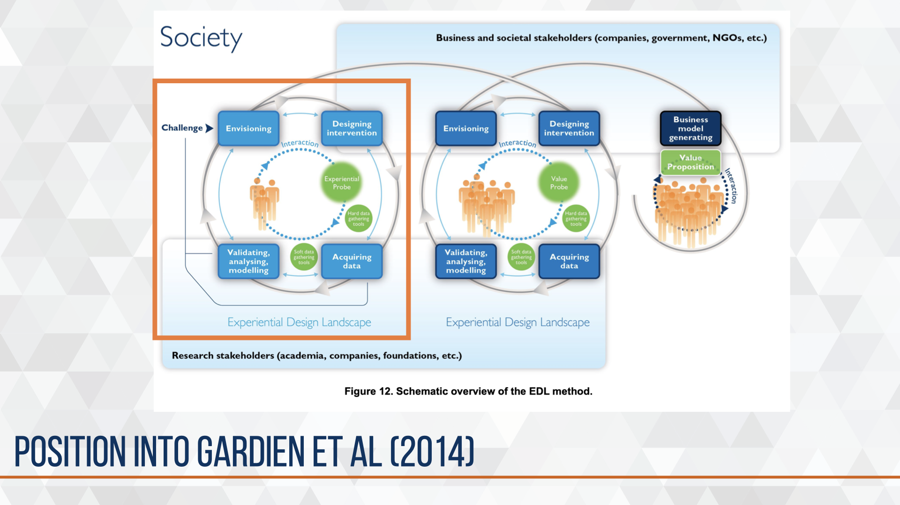
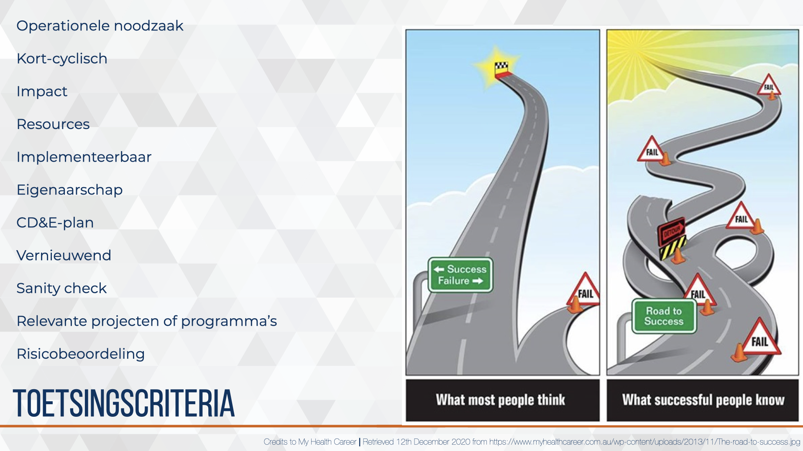
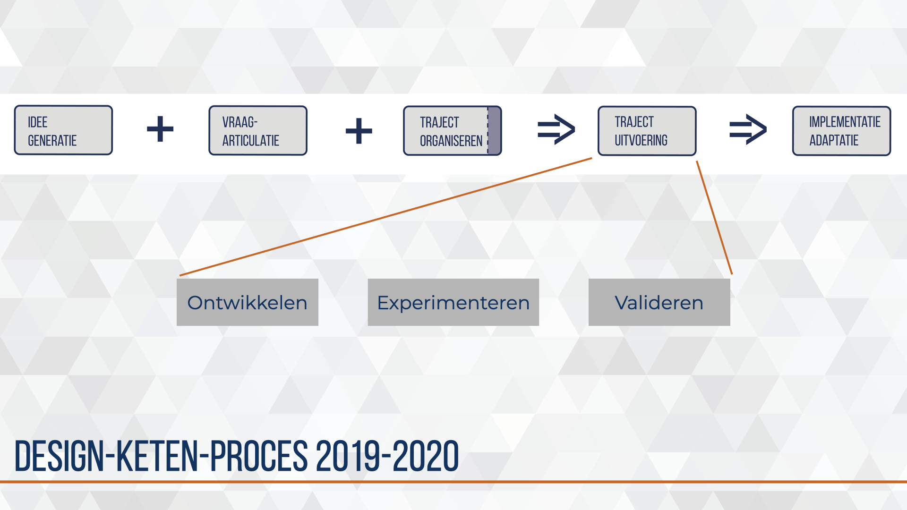
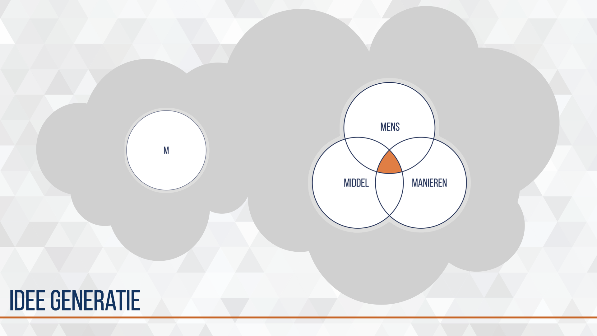
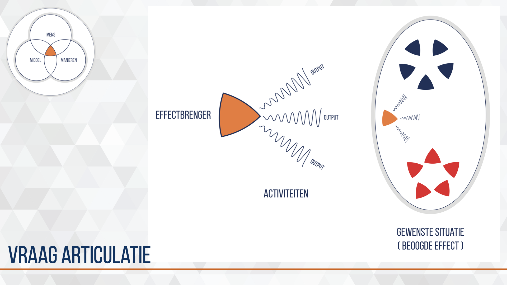
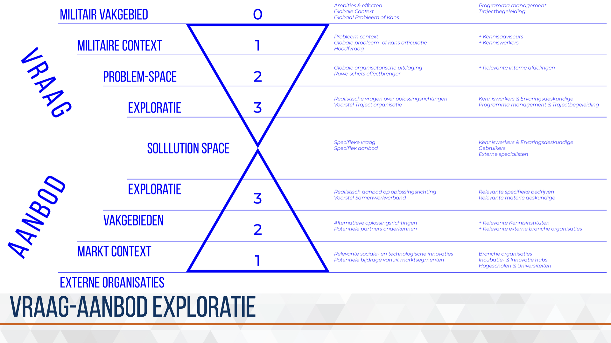

# CD&E process {#CD&E-process}
<!--  -->
```{r, fig.cap=' ', echo=FALSE}
# img_dir <-
img1_path <- "data/keynote-slides/20200430-CDE-Designprocess/20200430-CDE-Designprocess.018.png"
img1 <- readPNG(img1_path, native = TRUE, info = TRUE)
knitr::include_graphics(img1_path)
rm(img1_path, img1)
```

De organisatorische uitdaging die de kenniswerker en de trajectbegeleiding hebben ligt vooral in de Hoe-vragen. Op welke manier kan de beoogde effectbrenger worden ontworpen, ontwikkeld, getest en geïmplementeerd in de bestaande Landmacht organisatie? Er is geen pasklaar antwoord, maar door de vele trajecten is wel een rode draad te ontdekken en zijn een aantal activiteiten, methoden en instrumenten die effectief blijken en vaker terug komen.

Vanuit deze kennis, vaardigheid en ervaring is het CD&E design proces ontwikkeld, en wordt het nog regelmatig aangepast, verbeterd en uitgebreid.

Hierna volgen de verschillende bouwstenen die gebuikt kunnen worden om het design proces vorm te geven. De bijzondere volgorde waarin de bouwstenen worden gepresenteerd zijn het meest effectief in de bureaucratische overheidsorganisatie Defensie die tevens als Aanbestedende dienst wordt gekenmerkt in de aanbestedingswet.

## position into crafstmen
<!--  -->
```{r, fig.cap='Het Military Design proces gepositioneerd in het EDL method.', echo=FALSE}
# img_dir <-
img1_path <- "data/keynote-slides/20200430-CDE-Designprocess/20200430-CDE-Designprocess.019.png"
img1 <- readPNG(img1_path, native = TRUE, info = TRUE)
knitr::include_graphics(img1_path)
rm(img1_path, img1)
```

Positioning the proces into the frame of @gardien_changing_2014.

## CD&E framework 2017-2018 (descriptive)
<!--  -->
```{r, fig.cap='Eerste schets van het CD&E design model uit 2018. ', echo=FALSE}
# img_dir <-
img1_path <- "data/keynote-slides/20200430-CDE-Designprocess/20200430-CDE-Designprocess.020.png"
img1 <- readPNG(img1_path, native = TRUE, info = TRUE)
knitr::include_graphics(img1_path)
rm(img1_path, img1)
```

De eerste schets van een framework van de inspanningen voor kort-cyclisch moderniseren voor het landoptreden. In het midden vier fase en stappen om te komen van een probleem naar een implementatie. Onderaan de schets de toenmalige middelen en diensten die door CD&E beschikbaar werden gesteld. De inspanningen waren gericht op het binnen halen van de externe innovatie (links) en via één of meerdere fase en stappen te brengen naar het vergroten van het innovatief vermogen in het landoptreden op de aspecten organisatie, doctrine en/of materieel. Deze inspanningen dragen uiteindelijk ook bij aan het verbeteren en versnellen van processen en procedures binnen de organisatie met de wens om zelfs culturele verandering te initiëren.

Het eerste framework werd gebruikt in een aantal projecten en bij het intern communiceren —en eenheid van opvatting creëren— over de initiatieven voor kort-cyclisch moderniseren in het landoptreden.

Als methodiek is het model van @klinkers_navigeren_2014 toegepast waarin de auteurs spreken van drie licenties. Licence to represent, licence to operate & licence to innovate.

Vanuit reflection in action ontstond het design-keten-proces, een basis template voor een CD&E-plan en een gemeenschappelijke taal.

## design-keten-proces 2018-2019
<!--  -->
```{r, fig.cap='Eerste opzet van MD&I activiteiten.', echo=FALSE}
# img_dir <-
img1_path <- "data/images/20190710-CDE-designproces_bouwstenenKeten.png"
img1 <- readPNG(img1_path, native = TRUE, info = TRUE)
knitr::include_graphics(img1_path)
rm(img1_path, img1)
```

Groei zorgt voor nieuwe uitdagingen, mogelijkheden en mensen. Het aantal moderniseringsvraagstukken steeg en werd gecompliceerder waardoor de noodzaak voor meer trajectbegeleiders ontstond, deze rol werd met prioriteit gevuld. Daarmee ontstond de noodzaak om de opgedane kennis, vaardigheid en ervaring te borgen. Hiervoor is het eerste design-keten-proces en bijhorende canvassen ontworpen, getest en geïmplementeerd in het team.

Voor het ontwerp is gebruik gemaakt van de ervaringen van vier trajectbegeleiders die enige ervaring hadden opgedaan in de periode 2015-2018 met het opstarten en organiseren van moderniseringsvraagstukken.

Bij het testen is gebruik gemaakt van vier nieuwe trajectbegeleiders zonder ervaring op nieuw ingebrachte vraagstukken. Deze vier nieuwe trajectbegeleiders werden opgeleid, getraind, begeleid en gecoacht door één ervaren trajectbegeleider.

Trajecten van idee naar implementatie zijn uniek.
Ieder traject een andere keten van bouwstenen.

**de eerste canvassen**
<!--  -->
```{r, fig.cap='Eerste canvassen prototype.', echo=FALSE}
# img_dir <-
img1_path <- "data/keynote-slides/20200430-CDE-Designprocess/20200430-CDE-Designprocess.023.png"
img1 <- readPNG(img1_path, native = TRUE, info = TRUE)
knitr::include_graphics(img1_path)
rm(img1_path, img1)
```

**toetsingscriteria**
<!--  -->
```{r, fig.cap='De indicatoren voor Military Design & Innovation.', echo=FALSE}
# img_dir <-
img1_path <- "data/keynote-slides/20200430-CDE-Designprocess/20200430-CDE-Designprocess.024.png"
img1 <- readPNG(img1_path, native = TRUE, info = TRUE)
knitr::include_graphics(img1_path)
rm(img1_path, img1)
```

Naast de canvassen en het mindmodel waren een aantal indicatoren opgesteld. Deze kregen helaas de naam selectie- of toetsingscriteria wat geen recht deed aan de kracht van indicatoren maar verwerd tot een binair goed/fout controle mechanisme. De indicatoren waren door mij opgesteld als reminder of checklist, ze moeten zijn overdacht en besproken in het proces. De mate waarin de indicator is doorgevoerd in het traject kan iets zeggen over de succesfactor op basis van eerdere kennis en ervaring.
**variaties op denkmodellen**
<!--  -->
```{r, fig.cap='Het RTDP-process is gebruikt als inspratie en methode om het MD&I te ontwikkelen.', echo=FALSE}
# img_dir <-
img1_path <- "data/keynote-slides/20200430-CDE-Designprocess/20200430-CDE-Designprocess.024-1.png"
img1 <- readPNG(img1_path, native = TRUE, info = TRUE)
knitr::include_graphics(img1_path)
rm(img1_path, img1)
```

**laatste ontwerp canvassen**
<!--  -->
```{r, fig.cap='Final ontwerp canvassen.', echo=FALSE}
# img_dir <-
img1_path <- "data/keynote-slides/20200430-CDE-Designprocess/20200430-CDE-Designprocess.025.png"
img1 <- readPNG(img1_path, native = TRUE, info = TRUE)
knitr::include_graphics(img1_path)
rm(img1_path, img1)
```


## design-keten-proces 2019-2020
<!--  -->
```{r, fig.cap='Verdieping van de uitvoering in drie activiteiten in 2019. ', echo=FALSE}
# img_dir <-
img1_path <- "data/keynote-slides/20200430-CDE-Designprocess/20200430-CDE-Designprocess.026.png"
img1 <- readPNG(img1_path, native = TRUE, info = TRUE)
knitr::include_graphics(img1_path)
rm(img1_path, img1)
```

Bij het toenemen van vraag naar CD&E faciliteiten en -steun groeide het aantal trajecten. Hierdoor konden de CD&E-medewerkers reflection in action toepassen op de wijze waarop hun werk wordt verricht. Hieruit komen het CD&E design keten proces, de rol van Trajectbegeleiders en de ontwikkeling van instrumentarium om het werk en het proces te ondersteunen. Deze werden getest en verder verdiept door het opleiden en begeleiden van nieuwe CD&E-medewerkers die gedurende twee jaar het team kwamen versterken.

Het woord traject is geïntroduceerd om het discours en de mindset te richten op het onderscheidende van deze aanpak ten opzichte van een standaard landmacht project aanpak. Het traject start met een idee en eindigt bij succesvol doorlopen tot formele opname in de organisatie.

Ieder traject van idee naar implementatie is uniek en bestaat uit een keten van bouwstenen specifiek voor het voorliggend vraagstuk.

<!--  -->
```{r, fig.cap=' ', echo=FALSE}
# img_dir <-
img1_path <- "data/keynote-slides/20200430-CDE-Designprocess/20200430-CDE-Designprocess.027.png"
img1 <- readPNG(img1_path, native = TRUE, info = TRUE)
knitr::include_graphics(img1_path)
rm(img1_path, img1)
```

### idee generatie
<!--  -->
```{r, fig.cap=' ', echo=FALSE}
# img_dir <-
img1_path <- "data/keynote-slides/20200430-CDE-Designprocess/20200430-CDE-Designprocess.028.png"
img1 <- readPNG(img1_path, native = TRUE, info = TRUE)
knitr::include_graphics(img1_path)
rm(img1_path, img1)
```

In een forecasting zien we vaak een kenniswerker of collega van een parate eenheid die met een idee komt die een verbetering oplevert voor de directe taakstelling of werkomgeving, dan wel het kennisgebied waarin de collega werkzaam is. Dit idee is nog niet altijd volledig of biedt nog onvoldoende houvast om te komen tot een traject. Wel geeft het veel informatie over latente vraagstukken, problemen of kansen die in een specifieke context leven.

In een backcasting worden in de toekomst vraagstukken geadresseerd vanuit de routekaarten van operationele wensen en behoeften. Aan deze routekaarten wordt nog hard gewerkt en concrete voorbeelden ontbreken op dit moment.

Bij idee generatie brengt de trajectbegeleider de idee-inbrenger van een ‘m-gedreven’ idee naar een een ‘m-m-m gedreven’ concept. Dit gebeurt in maximaal drie werksessies die in maximaal vier weken worden ingepland. Dit zorgt voor betrokkenheid en beschikbaarheid van relevante actoren en brengt een positieve start van het traject op gang.

### vraag articulatie
<!--  -->
```{r, fig.cap=' ', echo=FALSE}
# img_dir <-
img1_path <- "data/keynote-slides/20200430-CDE-Designprocess/20200430-CDE-Designprocess.029.png"
img1 <- readPNG(img1_path, native = TRUE, info = TRUE)
knitr::include_graphics(img1_path)
rm(img1_path, img1)
```

Bij CD&E geloven we in het betrekken van het innovatieve vermogen wat buiten de Defensie organisatie ligt. Om de juiste partners te vinden is het belangrijk een duidelijke vraag te stellen. Aan de hand van het canvas weet de trajectbegeleider, kenniswerker en ervaringsdeskundige een compleet beeld te schetsen van de probleemcontext, probleem, uitdaging voor de organisatie en de markt-, onderzoek- of ontwerp vragen.

Deze stap leidt tot een duidelijker beeld van de beoogde effectbrenger en de positie die deze effectbrenger heeft / kan krijgen in de bestaande organisatie. Naast dit design concept wordt ook de situatie geschetst waarin de effectbrenger moet acteren. Dit brengt inzicht in de verschillende aspecten die in het experiment moeten worden opgenomen. Ook geeft het de positionering aan van het design concept in de routekaart van operationele behoefte en wensen.

### traject organiseren
<!--  -->
```{r, fig.cap=' ', echo=FALSE}
# img_dir <-
img1_path <- "data/keynote-slides/20200430-CDE-Designprocess/20200430-CDE-Designprocess.030.png"
img1 <- readPNG(img1_path, native = TRUE, info = TRUE)
knitr::include_graphics(img1_path)
rm(img1_path, img1)
```

Als het idee en de vraag voldoende duidelijk zijn, komt de vraag hoe deze in een project tot uitvoering gebracht kunnen worden. Verschillende interne en externe -rode- actoren zijn direct betrokken om het design concept te ontwikkelen, experimenteren en valideren, terwijl er ook -blauwe- actoren zijn die op meer afstand op specifieke momenten ondersteunen.

Net als in voorgaande bouwstenen staat het idee/design concept centraal. Verschillende rollen moeten worden ingevuld door relevante actoren. Denk daarbij aan kenniseigenaar, projectleider, probleem-eigenaar, werkgever (i.r.t. bedrijfsveiligheid) en experimenteer-omgeving. Het projectteam krijgt steun en faciliteiten om een tijdelijke organisatie op te bouwen rondom het design concept. Verwerving en planning voor het project moet worden voorbereid en in sommige gevallen moeten meerdere adviseur worden geconsulteerd om potentiële ‘struikelblokjes’ in het vervolg traject te identificeren en hopelijk voorkomen.

De drie bouwstenen samen geven een totaal beeld van het moderniseringsinitiatief. Dit wordt kort en bondig beschreven in een CD&E-plan, meestal in het format 5WH. Er wordt momenteel gewerkt aan een visual op poster formaat zodat een breed publiek wordt geïnformeerd over het initiatief.

### verwerving en levering
Om kort-cyclisch te moderniseren moeten randvoorwaarden worden ingericht die niet beschikbaar zijn in de bestaande organisatie.  Dit leidt tot een behoefte aan producten, diensten of partnerschappen. Deze worden voor de duur van het traject verworven door onze dedicated inkopers. De korte lijn die daardoor ontstaat maakt het mogelijk om snelheid en controle te behouden in de verwerving en levering en contract management te voeren na levering en bij gebruik.

Het is belangrijk te onderkennen dat aan deze bouwstenen vaste en variabele doorlooptijden zijn verbonden. Het kan daarom nuttig zijn om in een eerder stadium te starten met de voorbereidingen voor de verwerving. De uiteindelijke productie en levering hebben we bijna niet in de hand maar blijkt altijd weer langer te duren dan het projectteam inschat. De trajectbegeleider zorgt daarom dat hij zo snel als mogelijk wordt geadviseerd in de mogelijke verwerving-strategieën.

### experimenteren en valideren
<!--  -->
```{r, fig.cap=' ', echo=FALSE}
# img_dir <-
img1_path <- "data/images/20190710-CDE-designproces_trajectuitvoering.png"
img1 <- readPNG(img1_path, native = TRUE, info = TRUE)
img1 <- readPNG(img1_path, native = TRUE, info = TRUE)
knitr::include_graphics(img1_path)
rm(img1_path, img1)
```

Binnen de Landmacht worden regelmatig testen uitgevoerd op middelen. Een verwervingsproces kent vaak gebruikers veldtesten voor vergelijkend onderzoek. Denk aan een compagnie die verschillende schoenen test die door leveranciers worden aangeboden in een vervangingsproject voor de hele Defensie. Experimenten in een operationeel setting is nog onvoldoende ontwikkeld. De mogelijkheden om een enigszins gecontroleerde omgeving te creëren zijn aanwezig maar de kennis en vaardigheden voor het opbouwen en uitvoeren van een valide, betrouwbaar en reproduceerbaar experiment zijn nog onvoldoende.

Een systematische validatie van het idee in de experiment context ontbreekt op dit moment. De eerste stappen voor het ontwikkelen van deze bouwsteen zijn gezet. Zo is validatie al beschreven in het Design model en wordt bij nieuwe voorstellen al specifiek nagedacht over het meten en meetmethode van het experiment. Mede door de diversiteit aan vraagstukken en domeinen zal dit geen one-size-fits-all validatie worden.

### vraag-aanbod exploratie
<!--  -->
```{r, fig.cap=' ', echo=FALSE}
# img_dir <-
img1_path <- "data/keynote-slides/20200430-CDE-Designprocess/20200430-CDE-Designprocess.033.png"
img1 <- readPNG(img1_path, native = TRUE, info = TRUE)
knitr::include_graphics(img1_path)
rm(img1_path, img1)
```

Om externe partijen in een vroegtijdig stadium te betrekken bij het opstellen van routekaarten van operationele wensen en behoefte wordt de bouwsteen vraag-aanbod exploratie ontwikkeld. Het eerste concept is visueel weergegeven. De insteek is een dialoog tussen vraag en aanbod kant waarbij in zes stappen wordt toegewerkt naar het punt waarop de vraagarticulatie en aanbodarticulatie elkaar vinden. Mede door de complexiteit van wet- en regelgeving en botsende waarden is dit een ingewikkeld proces wat nog niet is getoetst in de praktijk.
