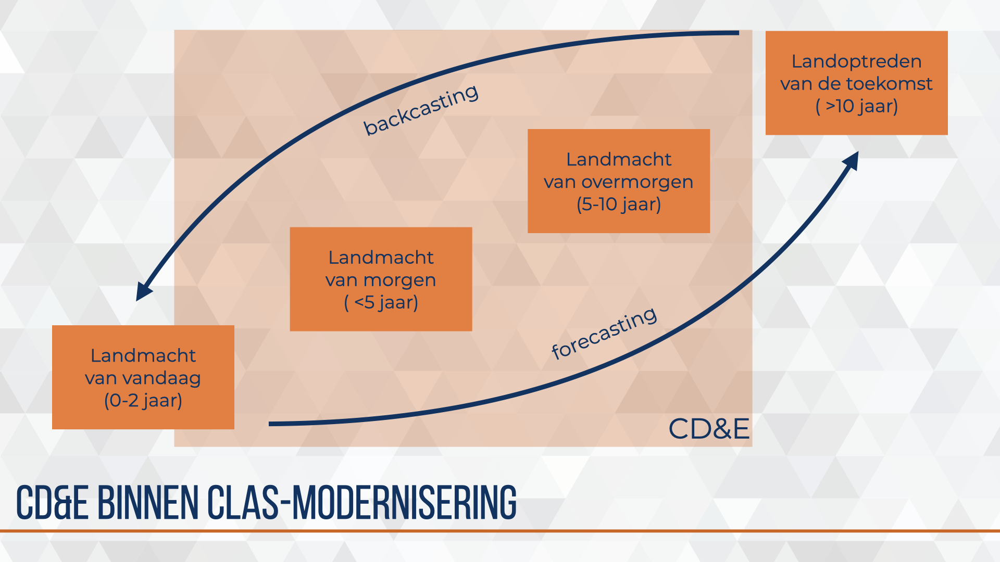
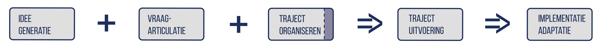
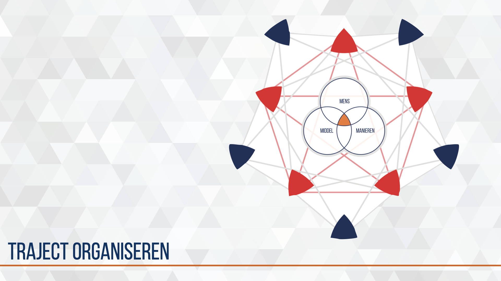
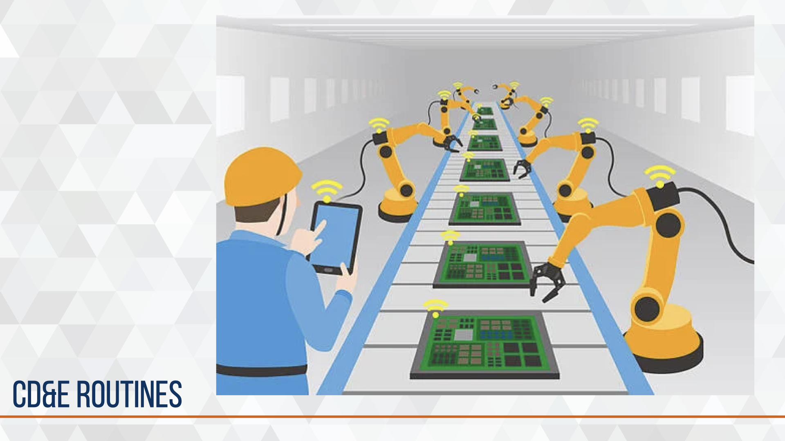
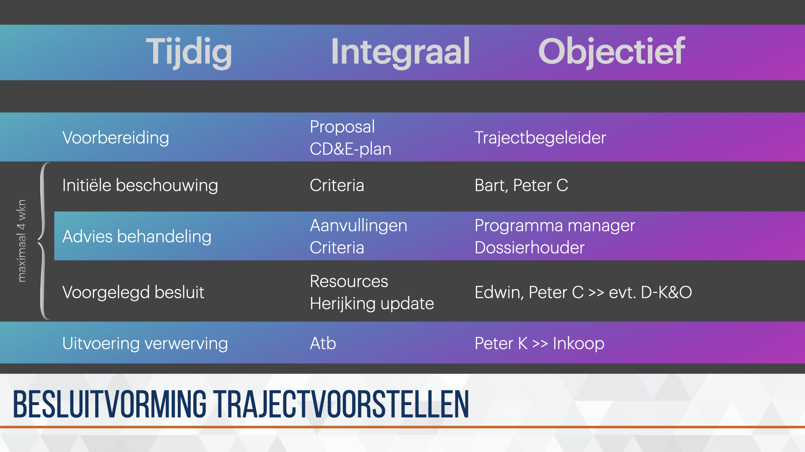

--- 
title: "Explore Military Design & Innovation"
author: "C.P. Corvers"
date: "`r Sys.Date()`"
site: bookdown::bookdown_site
documentclass: book
bibliography: [book.bib, packages.bib, mildi.bib]
biblio-style: apalike
link-citations: yes
description: "This is a minimal example of using the bookdown package to write a book. The output format for this example is bookdown::gitbook."
---
```{r}
library(knitr)    # For knitting document and include_graphics function
library(ggplot2)  # For plotting
library(png)      # For grabbing the dimensions of png files
```
<!-- # Prerequisites -->

<!-- This is a _sample_ book written in **Markdown**. You can use anything that Pandoc's Markdown supports, e.g., a math equation $a^2 + b^2 = c^2$. -->

<!-- The **bookdown** package can be installed from CRAN or Github: -->

<!-- ```{r eval=FALSE} -->
<!-- install.packages("bookdown") -->
<!-- # or the development version -->
<!-- # devtools::install_github("rstudio/bookdown") -->
<!-- ``` -->

<!-- Remember each Rmd file contains one and only one chapter, and a chapter is defined by the first-level heading `#`. -->

<!-- To compile this example to PDF, you need XeLaTeX. You are recommended to install TinyTeX (which includes XeLaTeX): <https://yihui.org/tinytex/>. -->

<!-- ```{r include=FALSE} -->
<!-- # automatically create a bib database for R packages -->
<!-- knitr::write_bib(c( -->
<!--   .packages(), 'bookdown', 'knitr', 'rmarkdown' -->
<!-- ), 'packages.bib') -->
<!-- ``` -->

<!--chapter:end:index.Rmd-->

# Introduction {#intro}


Sinds januari 2019 heeft het Commando Landstrijdkrachten (CLAS) een vierde directie in de staf opgenomen, de directie Kennis & Ontwikkeling (DK&O). Onder deze directie worden drie afdelingen functioneel georganiseerd, dit zijn de afdeling Strategie & Plannen (S&P), afdeling Regie (LWC/Regie) en de afdeling Innovatie. Deze laatste is een samenvoeging van de programma's De Adaptieve Krijgsmacht - CLAS (DAK-C) en Concept Development & Experimentation (CD&E).

CD&E is in 2015 gestart als zogenaamde kwartiermakersgroep en heeft naam gemaakt als afdeling, methode en resources voor kort cyclische modernisering voor het landoptreden.

Ik mag sinds oktober 2017 mijn bijdrage leveren aan CD&E. Startend als algemeen stafofficier junior hebben we met een klein team een methode, proces, tools en concept ontwikkeld waarmee we kenniscentra en parate eenheden in staat konden stellen hun ideeën, en problemen om te zetten in vraagstukken die samen met interne en externe partijen middels experimenten konden worden beantwoord en —als ultieme doel— formeel opgenomen in de organisatie (implementatie).

#### leeswijzer {-}
```{r, index, fig.cap='Index', echo=FALSE}
# img_dir <-
img1_path <- "_bookdown_files/images/keynote-slides/20200430-CDE-Designprocess/20200430-CDE-Designprocess.002.png"
img1 <- readPNG(img1_path, native = TRUE, info = TRUE)
knitr::include_graphics(img1_path)
```
<!--  -->

In chronologische volgorde komen de volgende onderwerpen voorbij.

**[CD&E algemeen]\@ref(#CD&E-algemeen)**
missie, conceptuele en organisatorische positionering en organisatiestructuur

**[Kort-cyclisch-moderniseren](#Kort-cyclisch-moderniseren)**
Het denken in effectbrengers

**[CD&E design model](#CD&E-design-model)**
Het denken over ontwikkelen en experimenteren van effectbrengers

**[CD&E design proces](#CD&E-design-proces)**
Technieken en tools voor articuleren, organiseren, uitvoeren en rapporteren

**[CD&E routines](#CD&E-routines)**
Procedures voor besluitvorming over moderniseirngsvoorstellen

See `r ref:(Index)` [#Index]

# CD&E algemeen {#cd&e-algemeen}


## aanleiding
De reden om als Landmacht te innoveren met externe partners ligt in de realiteit dat een leger altijd beter moet zijn dan de tegenstander maar legers niet langer de innovatie aanjagen. De markt en economische marktwerking heeft dit overgenomen.

En daar waar de Landmacht het idee had de ontwikkelingen voldoende te kunnen volgen, kreeg de Commandant Landstrijdkrachten de spiegel voorgehouden door de voorzitter/directeur van werkgeversorganisatie FME-CWM tijdens de Future Force Conference in 2015.

## missie
De missie van CD&E is het enige wat sinds 2017 stand houdt alle andere zaken zijn door de groei, successen (en mislukkingen) en de omgeving verandert, verbeterd of doorontwikkeld.
> CD&E ontsluit het innovatieve vermogen van het bedrijfsleven en kennisinstituten voor het moderniseringsproces van de Land- en/of Krijgsmacht zodat onze eenheden tijdens inzet relevant en waar nodig dominant blijven.

## beleid

Er zijn een aantal beleidsdocumenten die het moderniseren en innoveren van de Land- en Krijgsmacht sturen. Drie documenten zkomen met enige regelmaat terug. De Defensievisie 2035, Vechten voor een veilige toekomst beschrijft de inrichtingsprincipes voor de eerstkomende jaren. De Strategische kennis- en innovatieagenda geeft meer thematisch aan in welke onderwerpen Defensie de focus legt. De Visie Commando Landstrijdkrachten, Veigliheid is vooruitzien, beschrijft het toekomstbeeld van de Kominklijke Landmacht. Deze is intern verder vertaald in het Operationeel kader landoptreden (OKL).

Als definitie voor innovatie volgt CD&E de Adviesraad voor Wetenschap, Technologie en Innovatie.

>Innovatie: “de implementatie van een nieuw of significant vernieuwd product of dienst, proces, nieuwe marketingmethode of een nieuw organisatiemodel.“ [@awti-2014]

## uitgangspunten
Bij het ontwikkelen van een modellen en processen zijn er een aantal zaken waar de Landmacht rekening mee moet houden. Bij wet kent de Landmacht een aantal verplichtingen zoals de wijze waarop partners en leveranciers worden geselecteerd of de manier waarop geld wordt uitgegeven.

Daarnaast kent de organisatie een snelle doorstroom van functionarissen en dwingende processen en regels.
Functionarissen doen wat zij kennen, weten en wat de afdeling of eenheid gewoon is te doen vanuit de intentie kwaliteit te willen leveren als vakmensen. Door de snelle doorstroom is het lastig de mogelijkheden van de wet- en regelgeving ten volle te benutten.
Procedures maken de gang van zaken controleerbaar, repeteerbaar en voorspelbaar maar vooral borgt het de sociale waarden van de Landmacht als overheidsorganisatie.

Dit resulteert in drie uitgangspunten die kaderstellend zijn bij het doorontwikkelen van modellen, processen en instrumenten voor Military Design & Innovation.

**Landmacht is een aanbestedende dienst**

Europese wetgeving

**Landmacht is een rijksoverheidsorganisatie**

Ministeriële verantwoording aan parlement over verantwoorde uitgave belastinggeld

**Landmacht is een bureaucratische organisatie**

Door processen en regelgeving is de organisatie non-discriminatief conform Weber’s model

## moderniseringsmodellen


Voor de lang-cyclische modernisering kent de Landmacht het CLAS moderniseringsmodel waar vanuit een future scan (landoptreden van de toekomst LvT) wordt toegewerkt naar een force design (Landmacht van overmorgen LvOM), force building (Landmacht van morgen LvM) en force employment (Landmacht van vandaag LvL).

Defensie breed is de lang-cyclische modernisering en innovatie ingericht als een ‘huis’. Dit kennis- en innovatie model is al jaren in gebruik en voorziet in vele instrumenten en processen om innovatie op lange termijn toe te passen. Echter het gebruiken van nieuwe snel opkomende innovaties kunnen hiermee niet adequaat worden getest en geïmplementeerd.

Met CD&E werkt de Landmacht sinds 2015 aan het versnellen, verbinden en vermarkten van opkomende technologieën door het organiseren en structureren van kort-cyclische innovatie.

### CD&E binnen CLAS-modernisering
[fig:simpel-proces]

Figuur \@ref(fig:simpel-proces) en vereenvoudigde visualisatie van het ‘klassieke’ moderniseringsproces van de Landmacht. Dit proces kan worden onderverdeeld in vier aandachtsgebieden, de landmacht van vandaag (LvV), morgen (LvM), overmorgen (LvOM) en het landoptreden van de toekomst (LvT). Verschillende organisatie-onderdelen dragen bij aan deze aandachtsgebieden. Grofweg kan de verantwoordelijkheid (responsibility) worden toebedeeld aan respectievelijk de parate eenheid, afdeling strategie & plannen, kenniscentrum en afdeling trends & concepts.
In dit proces vindt backcasting plaats doordat onderzoek, studies en verkenningen richting geven aan modernisering voor LvM en LvV en forecasting doordat evaluaties, lessons learned en experimenten richting geven aan beleid, budgettering en kennisplanning.

CD&E programma’s dragen hoofdzakelijk bij aan de landmacht van morgen en overmorgen.

## positionering in defensie organisatie


CD&E is het innovatiecentrum van de Landmacht. Ook de andere defensieonderdelen kennen innovatiecentra, ieder opgebouwd in de kenmerken en cultuur van het defensieonderdeel.

## organisatie 2019: multi-project management


In 2019 groeide het team dusdanig dat enige verdeling en specialisatie onvermijdelijk werd. Teams werden ingericht naar activiteiten en he niveau wat hoofdzakelijk werd gesteund.
Trajecten groepeerde de trajectbegeleiders en werkte voornamelijk met de kenniswerkers (kennis- en expertise centra) en stafmedewerkers (parate eenheid).
Binnen Programma’s zaten programma-managers die de kennisadviseurs en dossierhouders (afdeling Strategie en Plannen) steunde in het opzetten van routekaarten van operationele wensen en behoefte.
Ontwikkelen was gericht op de strategische inbedding van alle inspanningen.
Bedrijfsvoering voor alle CD&E ondersteunende processen, uitvoering evenementen en logistieke ondersteuning.
De vele individuele of specifieke teamleden werden onder Specialisten geschaard.

De aanpak is een olievlekwerking. Met trajecten en programma’s voorbeelden creëren waardoor operationele en bedrijfsmatige knelpunten zichtbaar worden zodat deze geadresseerd kunnen worden bij de juiste entiteiten. Dit draagt bij aan het structureel kort-cyclisch moderniseren in het landoptreden.

## transitie 2020


In 2020 deden we een herijking op het project portfolio zodat de focus blijft op de juiste initiatieven. Deze herijking was een staf integraal beschouwen van projecten op relevantie, urgentie, noodzaak en realiseerbaarheid binnen het landoptreden. De herijking maakte de vele initiatieven inzichtelijk en keuzen door Directeur Kennis & Ontwikkeling mogelijk. De multi-project aanpak creeerde daarmee een vorm van overzicht, inzicht en regie. (Foto brownpaper nog toevoegen)

Het werd tijd voor de volgende stap waarin meer richting wordt gegeven aan de initiatieven vanuit ambitie, markt tempo en markt potentieel.

De programmatische aanpak was daarvoor gekozen. Programma-managers inventariseren moderniseringsinitiatieven bij de 9-14 kennisadviseurs m.b.v. Boill Sharp’s 3-horizon model en visualiseren met hiërarchie-boom-structuur.

## organisatie 2020: portfolio management


In 2020 groeide CD&E uit tot een volwaardige innovatie partner, werden CD&E en DAK-C samengevoegd in een Afdeling Innovatie onder de Directie Kennis & Ontwikkeling, consolideerde het budget, werden de moderniseringsvraagstukken groter en complexer en werd zichtbaar en merkbaar voortgang geboekt met strategische inbedding.

Het was tijd om opnieuw de structuur en benadering aan te passen. Programma-management is de gekozen aanpak omdat dit planbaar en beheersbaar is in de interne bedrijfsvoering en herkenbaarheid en vertrouwen creëert in de samenwerking met externe partners (koepelorganisaties, MKB-ers, kennisinstituten). Er worden daarom hoofd-programma’s geformeerd rondom een specifiek thema, hierin zitten verschillende moderniseringsprojecten. Een programmateam met programma-managers en trajectbegeleiders werken samen aan het hoofdprogramma.

Alle programma’s komen onder uitvoering terwijl de (door)ontwikkeling en strategische inbedding worden samengebracht bij Strategic Business & Innovation Development (SBID). Er komst dus een scheiding tussen toekomst, uitvoering en ondersteuning.

## CD&E middelen


De uitvoering van kort cyclische moderniseringsprojecten vindt plaats op locatie en in eigenaarschap van een kenniscentrum of parate eenheid, CD&E steunt en faciliteert. Hiervoor heeft CD&E een aantal middelen en diensten tot haar beschikking. Dit zijn de middelen en diensten die niet vanzelfsprekend toegankelijk zijn voor de betrokken partijen of vanwege schaarste of efficiëntie beter tot hun recht komen door centrale positionering.

### experimenteer omgeving & innovatie hub


De eerste grootschalige uitvraag aan de markt heeft in 2016 plaats gevonden. Gericht op de base van de toekomst zijn de uitdagingen geschetst op de thema’s energie, bescherming, water en logistiek. Op Kamp Soesterberg is de basis van een militair kampement opgebouwd met de formele fieldlab status van Smart Industry. Dit Fieldlab Smartbase heeft de Landmacht veel ervaring en kennis opgeleverd over het proces en inhoud.
Sinds september 2019 is dit fieldlab verhuist naar Complex Ede-Driesprong waar externe partners kunnen experimenteren binnen de militaire context.

# Kort-cyclisch-moderniseren


De landmacht is een overheids organisatie die -waar nodig- een zwaardmacht moet zijn waar vrede en veiligheid geen vanzelfsprekendheid is. Vanuit de grondwettelijke taken is afgeleid hoe de Landmacht optreedt, welke materieel en personele middelen daarvoor nodig zijn en hoe dit wordt georganiseerd. De bestaande Landmacht organisatie is in een continue verbeter modus vanuit deze volgordelijkheid.
De technologische en sociale innovaties gaan echter zo snel dat ook op andere, snellere manieren moet worden gekeken naar modernisering van de bestaande organisatie.
CD&E is een manier om kort-cyclisch moderniseren uit te voeren. Centraal staat daarbij een integrale aanpak, met externe partijen door experimenten. Het model wat we hierbij gebruiken zie je op de slide.

## effectbrenger

Een military capability, organisatie onderdeel of subsysteem is een unieke combinatie van Mens, Manieren en Middel(en). Deze unieke combinatie noemen we binnen CD&E een effectbrenger. Deze voert activiteiten uit met een specifieke, direct te relateren, output.

## gewenst effect en ambitie

De activiteiten en output genereren een reactie in de omgeving, het indirect te relateren, effect.
Een beoogde effectbrenger voert activiteiten uit in een specifieke context. Meestal is sprake van een bestaande effectbrenger die verbeterd wordt en is er dus ook sprake van een huidige situatie.
Samen met interne en externe partners ontwikkeld het kenniscentrum of de eenheid de beoogde effectbrenger zodat deze getest kan worden in een gecontroleerde, operationele omgeving.
Door het opzetten van een experimentele omgeving kan de ontwikkelde effectbrenger worden beproefd en kunnen de effecten op de omgeving worden waargenomen.
Een vraag voor een experiment is de haalbaarheid van het beoogde effect door de effectbrenger in een specifieke situatie. Afhankelijk van de experimenteer-omgeving zullen verschillende methoden worden toegepast om te kunnen concluderen of het beoogde effect bereikt kan worden.

# CD&E design model {#CD&E-design-model}


In het Design model wordt de samenstelling (synthese) van de verschillende subsystemen tot een (beoogd) effect in een specifieke context (de gewenste situatie) gevisualiseerd. Daarmee kan in een zeer abstracte visualisatie het traject van idee tot en met valideren worden geduid.

We zagen eerder de effectbrenger als een unieke samenstelling van mens, manieren en middel. Deze effectbrenger met activiteiten en output verhoud zich tot andere effectbrengers binnen een specifieke context (huidige situatie). Het idee voor een gemoderniseerde effectbrenger zal moeten bijdragen aan een effect in een specifieke context (gewenste situatie).  Door experimenteren wordt —een variant van— een gemoderniseerde effectbrenger ingebracht in een afgebakende, gecontroleerde context (experimentele situatie).

Het doel van het Design model is de relaties en afhankelijkheden van idee, effectbrenger en context te herkennen en daarbij te onderzoeken of het aanbrengen van een wijziging in een bestaande situatie leidt tot een meer gewenste of geambieerde situatie.

Het idee wordt geplaatst in ‘het grotere plaatje’ van het landoptreden.

## design & innovation framework


## ontwerpen

Inzoomen op het ontwerpen van een effectbrenger zijn we binnen  CD&E steeds meer geïnteresseerd hoe we van rechts naar links kunnen ontwerpen. Dat wil zeggen vanuit een geambieerde situatie met beoogde effect een output’s, activiteiten en effectbrengers voorstellen die gerealiseerd kunnen worden door het combineren van mens, manieren en middel.

Voor het articuleren van ambitie en ontwikkel lijnen wordt gebruik gemaakt van het 3-Horizon model van Bill Sharp. Onder begeleiding van een programma-manager wordt met de verantwoordelijk kennisadviseur en betrokken kenniswerkers en subject matter expert een routekaar van operationele wensen en behoefte opgesteld. Deze routekaart leidt ondermeer tot strategisch onderbouwde keuze voor het oppakken van ideeën en experimenten.

## ontwerpen & ontwikkelen

Inzoomen op de effectbrenger als operationele entiteit zien we een fractile pattern ontstaan. Zoals we een groep plaatsen in een peloton, compagnie, bataljon en brigade maakt een effectbrenger ook altijd deel uit van een groter verband. Dit zorgt voor een extra dimensie in de complexiteit van het Design process. Voorlopig noem ik deze dimensie de operationele opschaling.

## experimenteren

Een beoogde effectbrenger voert activiteiten uit in een specifieke context. Meestal is sprake van een bestaande effectbrenger die verbeterd wordt en is er dus ook sprake van een huidige situatie.
Samen met interne en externe partners ontwikkeld een kenniscentrum of parate eenheid de beoogde effectbrenger zodat deze getest kan worden in een gecontroleerde, operationele omgeving.
Door het opzetten van een experimentele omgeving kan de ontwikkelde effectbrenger worden beproefd en kunnen de effecten op de omgeving worden waargenomen.

Data wordt verkregen door het verschil te meten tussen de huidige context met huidige effectbrengers en de experimentele context met beoogde effectbrenger. Na processing en analyse kan deze data worden beschouwd op de gewenste context om zodoende iets zinnigs te kunnen zeggen over de haalbaarheid, nut en noodzaak van het ontwerp.

## ontwikkelen en samenwerken


# CD&E process {#CD&E-process}

De organisatorische uitdaging die de kenniswerker en de trajectbegeleiding hebben ligt vooral in de Hoe-vragen. Op welke manier kan de beoogde effectbrenger worden ontworpen, ontwikkeld, getest en geïmplementeerd in de bestaande Landmacht organisatie? Er is geen pasklaar antwoord, maar door de vele trajecten is wel een rode draad te ontdekken en zijn een aantal activiteiten, methoden en instrumenten die effectief blijken en vaker terug komen.

Vanuit deze kennis, vaardigheid en ervaring is het CD&E design proces ontwikkeld, en wordt het nog regelmatig aangepast, verbeterd en uitgebreid.

Hierna volgen de verschillende bouwstenen die gebuikt kunnen worden om het design proces vorm te geven. De bijzondere volgorde waarin de bouwstenen worden gepresenteerd zijn het meest effectief in de bureaucratische overheidsorganisatie Defensie die tevens als Aanbestedende dienst wordt gekenmerkt in de aanbestedingswet.

## position into crafstmen


Positioning the proces into the frame of @gardien_changing_2014.

## CD&E framework 2017-2018 (descriptive)

De eerste schets van een framework van de inspanningen voor kort-cyclisch moderniseren voor het landoptreden. In het midden vier fase en stappen om te komen van een probleem naar een implementatie. Onderaan de schets de toenmalige middelen en diensten die door CD&E beschikbaar werden gesteld. De inspanningen waren gericht op het binnen halen van de externe innovatie (links) en via één of meerdere fase en stappen te brengen naar het vergroten van het innovatief vermogen in het landoptreden op de aspecten organisatie, doctrine en/of materieel. Deze inspanningen dragen uiteindelijk ook bij aan het verbeteren en versnellen van processen en procedures binnen de organisatie met de wens om zelfs culturele verandering te initiëren.

Het eerste framework werd gebruikt in een aantal projecten en bij het intern communiceren —en eenheid van opvatting creëren— over de initiatieven voor kort-cyclisch moderniseren in het landoptreden.

Als methodiek is het model van @klinkers_navigeren_2014 toegepast waarin de auteurs spreken van drie licenties. Licence to represent, licence to operate & licence to innovate.

Vanuit reflection in action ontstond het design-keten-proces, een basis template voor een CD&E-plan en een gemeenschappelijke taal.

## design-keten-proces 2018-2019

Groei zorgt voor nieuwe uitdagingen, mogelijkheden en mensen. Het aantal moderniseringsvraagstukken steeg en werd gecompliceerder waardoor de noodzaak voor meer trajectbegeleiders ontstond, deze rol werd met prioriteit gevuld. Daarmee ontstond de noodzaak om de opgedane kennis, vaardigheid en ervaring te borgen. Hiervoor is het eerste design-keten-proces en bijhorende canvassen ontworpen, getest en geïmplementeerd in het team.

Voor het ontwerp is gebruik gemaakt van de ervaringen van vier trajectbegeleiders die enige ervaring hadden opgedaan in de periode 2015-2018 met het opstarten en organiseren van moderniseringsvraagstukken.

Bij het testen is gebruik gemaakt van vier nieuwe trajectbegeleiders zonder ervaring op nieuw ingebrachte vraagstukken. Deze vier nieuwe trajectbegeleiders werden opgeleid, getraind, begeleid en gecoacht door één ervaren trajectbegeleider.

Trajecten van idee naar implementatie zijn uniek.
Ieder traject een andere keten van bouwstenen.

**de eerste canvassen**

**toetsingscriteria**

Naast de canvassen en het mindmodel waren een aantal indicatoren opgesteld. Deze kregen helaas de naam selectie- of toetsingscriteria wat geen recht deed aan de kracht van indicatoren maar verwerd tot een binair goed/fout controle mechanisme. De indicatoren waren door mij opgesteld als reminder of checklist, ze moeten zijn overdacht en besproken in het proces. De mate waarin de indicator is doorgevoerd in het traject kan iets zeggen over de succesfactor op basis van eerdere kennis en ervaring.
**variaties op denkmodellen**

**laatste ontwerp canvassen**


## design-keten-proces 2019-2020

Bij het toenemen van vraag naar CD&E faciliteiten en -steun groeide het aantal trajecten. Hierdoor konden de CD&E-medewerkers reflection in action toepassen op de wijze waarop hun werk wordt verricht. Hieruit komen het CD&E design keten proces, de rol van Trajectbegeleiders en de ontwikkeling van instrumentarium om het werk en het proces te ondersteunen. Deze werden getest en verder verdiept door het opleiden en begeleiden van nieuwe CD&E-medewerkers die gedurende twee jaar het team kwamen versterken.

Het woord traject is geïntroduceerd om het discours en de mindset te richten op het onderscheidende van deze aanpak ten opzichte van een standaard landmacht project aanpak. Het traject start met een idee en eindigt bij succesvol doorlopen tot formele opname in de organisatie.

Ieder traject van idee naar implementatie is uniek en bestaat uit een keten van bouwstenen specifiek voor het voorliggend vraagstuk.


### idee generatie

In een forecasting zien we vaak een kenniswerker of collega van een parate eenheid die met een idee komt die een verbetering oplevert voor de directe taakstelling of werkomgeving, dan wel het kennisgebied waarin de collega werkzaam is. Dit idee is nog niet altijd volledig of biedt nog onvoldoende houvast om te komen tot een traject. Wel geeft het veel informatie over latente vraagstukken, problemen of kansen die in een specifieke context leven.

In een backcasting worden in de toekomst vraagstukken geadresseerd vanuit de routekaarten van operationele wensen en behoeften. Aan deze routekaarten wordt nog hard gewerkt en concrete voorbeelden ontbreken op dit moment.

Bij idee generatie brengt de trajectbegeleider de idee-inbrenger van een ‘m-gedreven’ idee naar een een ‘m-m-m gedreven’ concept. Dit gebeurt in maximaal drie werksessies die in maximaal vier weken worden ingepland. Dit zorgt voor betrokkenheid en beschikbaarheid van relevante actoren en brengt een positieve start van het traject op gang.

### vraag articulatie

Bij CD&E geloven we in het betrekken van het innovatieve vermogen wat buiten de Defensie organisatie ligt. Om de juiste partners te vinden is het belangrijk een duidelijke vraag te stellen. Aan de hand van het canvas weet de trajectbegeleider, kenniswerker en ervaringsdeskundige een compleet beeld te schetsen van de probleemcontext, probleem, uitdaging voor de organisatie en de markt-, onderzoek- of ontwerp vragen.

Deze stap leidt tot een duidelijker beeld van de beoogde effectbrenger en de positie die deze effectbrenger heeft / kan krijgen in de bestaande organisatie. Naast dit design concept wordt ook de situatie geschetst waarin de effectbrenger moet acteren. Dit brengt inzicht in de verschillende aspecten die in het experiment moeten worden opgenomen. Ook geeft het de positionering aan van het design concept in de routekaart van operationele behoefte en wensen.

### traject organiseren

Als het idee en de vraag voldoende duidelijk zijn, komt de vraag hoe deze in een project tot uitvoering gebracht kunnen worden. Verschillende interne en externe -rode- actoren zijn direct betrokken om het design concept te ontwikkelen, experimenteren en valideren, terwijl er ook -blauwe- actoren zijn die op meer afstand op specifieke momenten ondersteunen.

Net als in voorgaande bouwstenen staat het idee/design concept centraal. Verschillende rollen moeten worden ingevuld door relevante actoren. Denk daarbij aan kenniseigenaar, projectleider, probleem-eigenaar, werkgever (i.r.t. bedrijfsveiligheid) en experimenteer-omgeving. Het projectteam krijgt steun en faciliteiten om een tijdelijke organisatie op te bouwen rondom het design concept. Verwerving en planning voor het project moet worden voorbereid en in sommige gevallen moeten meerdere adviseur worden geconsulteerd om potentiële ‘struikelblokjes’ in het vervolg traject te identificeren en hopelijk voorkomen.

De drie bouwstenen samen geven een totaal beeld van het moderniseringsinitiatief. Dit wordt kort en bondig beschreven in een CD&E-plan, meestal in het format 5WH. Er wordt momenteel gewerkt aan een visual op poster formaat zodat een breed publiek wordt geïnformeerd over het initiatief.

### verwerving en levering
Om kort-cyclisch te moderniseren moeten randvoorwaarden worden ingericht die niet beschikbaar zijn in de bestaande organisatie.  Dit leidt tot een behoefte aan producten, diensten of partnerschappen. Deze worden voor de duur van het traject verworven door onze dedicated inkopers. De korte lijn die daardoor ontstaat maakt het mogelijk om snelheid en controle te behouden in de verwerving en levering en contract management te voeren na levering en bij gebruik.

Het is belangrijk te onderkennen dat aan deze bouwstenen vaste en variabele doorlooptijden zijn verbonden. Het kan daarom nuttig zijn om in een eerder stadium te starten met de voorbereidingen voor de verwerving. De uiteindelijke productie en levering hebben we bijna niet in de hand maar blijkt altijd weer langer te duren dan het projectteam inschat. De trajectbegeleider zorgt daarom dat hij zo snel als mogelijk wordt geadviseerd in de mogelijke verwerving-strategieën.

### experimenteren en valideren

Binnen de Landmacht worden regelmatig testen uitgevoerd op middelen. Een verwervingsproces kent vaak gebruikers veldtesten voor vergelijkend onderzoek. Denk aan een compagnie die verschillende schoenen test die door leveranciers worden aangeboden in een vervangingsproject voor de hele Defensie. Experimenten in een operationeel setting is nog onvoldoende ontwikkeld. De mogelijkheden om een enigszins gecontroleerde omgeving te creëren zijn aanwezig maar de kennis en vaardigheden voor het opbouwen en uitvoeren van een valide, betrouwbaar en reproduceerbaar experiment zijn nog onvoldoende.

Een systematische validatie van het idee in de experiment context ontbreekt op dit moment. De eerste stappen voor het ontwikkelen van deze bouwsteen zijn gezet. Zo is validatie al beschreven in het Design model en wordt bij nieuwe voorstellen al specifiek nagedacht over het meten en meetmethode van het experiment. Mede door de diversiteit aan vraagstukken en domeinen zal dit geen one-size-fits-all validatie worden.

### vraag-aanbod exploratie

Om externe partijen in een vroegtijdig stadium te betrekken bij het opstellen van routekaarten van operationele wensen en behoefte wordt de bouwsteen vraag-aanbod exploratie ontwikkeld. Het eerste concept is visueel weergegeven. De insteek is een dialoog tussen vraag en aanbod kant waarbij in zes stappen wordt toegewerkt naar het punt waarop de vraagarticulatie en aanbodarticulatie elkaar vinden. Mede door de complexiteit van wet- en regelgeving en botsende waarden is dit een ingewikkeld proces wat nog niet is getoetst in de praktijk.

# CD&E routines {#CD&E-routines}

In 2019 was het CD&E- budget gestegen tot €20M en was het portfolio voor het eerst groter dan het budget, €24M in 200+ projecten. We hebben ons gedwongen tot het —laten— maken van keuzen over de noodzaak, urgentie en haalbaarheid van de lopende projecten en nieuwe voorstellen. Dit proces betekende een herijking van de CD&E-inspanningen en vroeg om het beschouwen op de toetsingscriteria en fundamentele vragen over responsibility, accountability, projectduur en waarden van een project voor de organisatie.

Daarbij moet in ogenschouw genomen worden dat we een bureaucratische overheidsorganisatie zijn en derhalve te maken hebben met kenmerken als ‘ministeriële verantwoordelijkheid’, ’continue verantwoording van uitgaven’ en ‘aanbestedende dienst’.  Ook de signaalwerking naar de eigenaren van de projecten is van belang. Initiatieven mogen niet worden ontmoedigt maar alles goedkeuren behoorde tot het verleden.

Een herijkingsproces diende daardoor reproduceerbaar en uitlegbaar te zijn aan alle betrokken partijen tot aan de Minister. Het proces droeg ook bij aan een besluitvormingsproces voor de fase na herijking, zo ontstond uit de herijking een aantal routines om ook nieuwe voorstellen langs eenzelfde meetlat te leggen.

## communicatie in het CD&E-traject

Om alle belanghebbende te kunnen informeren over het vraagstuk, de aanpak en de uitkomsten worden een aantal documenten gebruikt.
Een CD&E-plan beschrijft of visualiseert voornamelijk het probleem, probleem-context, vraag, betrokken partijen, projectorganisatie, beoogde effect en globale aanpak voor ontwikkelen, experimenteren en valideren.
Een experimentplan kan later worden opgesteld en beschrijft of visualiseert in detail het experiment en validatie methode. Dit is voornamelijk bedoeld ten behoeve van de project-uitvoering.
Een rapportage communiceert de uitkomsten van een project en moet kunnen dienen als input voor de implementatie.

Na goedkeuring wordt een eventueel verwervingsproces uitgevoerd.

Tijdens het gehele proces wordt de voortgang bewaakt door de trajectbegeleider zodat er één persoon is die van begin tot eind zicht heeft op de ontwikkelingen.

## besluitvorming trajectvoorstellen

Voorafgaand aan de besluitvorming wordt een stafadvies opgesteld door de CD&E trajectbegeleider, S&P dossierhouder en CD&E programma-manager. Dit advies ontstaat door het beschouwen van het project-voorstel op de toetsingscriteria en wordt voorbereid en samengevat door de teamleider trajectbegeleiding. De focus ligt op noodzaak en urgentie van het voorstel ten opzichte van staande beleid en visie, veel gebruikte referenties zijn de visie C-LAS “Veiligheid en vooruitzien” en het Operationeel kader landoptreden (OKL). Na de inhoudelijke beschouwing worden eventuele financiële middelen toebedeeld.

Besluitvorming over een traject ligt in principe bij de Directeur Kennis & Ontwikkeling, dankzij de getoonde systematische aanpak is het vertrouwen gegeven om dit binnen CD&E te beleggen.

## toetsingscriteria


<!--chapter:end:01-intro.Rmd-->

`r if (knitr::is_html_output()) '
# References {-}
'`

<!--chapter:end:06-references.Rmd-->

